**Authors:** William Ratcliff II,¹*  

¹NIST Center for Neutron Research, National Institute of Standards and Technology, Gaithersburg, MD 20899, USA  

*Corresponding author: william.ratcliff@nist.gov

---

## Abstract

Autonomous neutron spectroscopy must solve three distinct tasks: **detection** (where is the signal?), **inference** (which Hamiltonian governs it?), and **refinement** (what are the parameters?). No single controller solves all three equally well. We present TAS-AI, a **hybrid agnostic→physics-informed** framework for autonomous triple-axis spin-wave spectroscopy that separates these tasks explicitly. In blind reconstruction benchmarks, where the controller must map an unknown response surface without prior model structure, model-agnostic methods such as random sampling, coarse grids, and Gaussian-process mappers reach a global error threshold more reliably and with fewer measurements than physics-informed planning. This supports the central claim that discovery and inference are distinct tasks requiring distinct controllers. Once signal structure is localized, the physics-informed stage performs **in-loop Hamiltonian discrimination and parameter refinement**: in a controlled square-lattice test between nearest-neighbor-only and $J_1$-$J_2$ Hamiltonians, TAS-AI reaches a decisive AIC-derived evidence ratio (>100) in fewer than 10 measurements, while motion-aware scheduling cuts wall-clock time by 32% at a fixed measurement budget. We further identify a failure mode of posterior-weighted design, **algorithmic myopia**, in which the planner over-refines the current leading model while under-sampling low-intensity falsification probes. A **constrained falsification channel** sharply reduces time spent committed to the wrong model and accelerates correct model selection without modifying the Bayesian inference engine. In controlled two-model ablations, both a simple deterministic top-two max-disagreement rule and an LLM-based audit committee achieve this gain under identical constraints, showing that the active ingredient is the falsification principle rather than the specific implementation. In a targeted multi-model stress test, however, top-two max-disagreement becomes structurally blind because the decisive falsifier separates the current leader from a lower-ranked model rather than from the runner-up; a broader falsification policy and the LLM both recover. The LLM additionally handles diverse ambiguity descriptions through the same interface without per-problem engineering. We demonstrate the full workflow *in silico* using a high-fidelity digital twin and provide an open-source Python implementation.

**Keywords:** autonomous experiments, neutron scattering, spin waves, Bayesian optimization, active learning, triple-axis spectrometer, strategic falsification

---

## 1. Introduction

Spin-wave spectroscopy is a gateway to quantum materials. It reveals exchange pathways, anisotropies, and emergent excitations in ordered magnets, multiferroics, and unconventional superconductors that underpin functional behavior.[@ratcliff2016review; @senff2007tbmno3; @jeong2012bifeo3; @matsuda2012bifeo3; @disseler2015lufeo3; @coldea2001la2cuo4] Triple-axis spectrometers remain the instrument of choice for detailed spin-wave characterization,[@brockhouse1995] but even modern multiplexed variants survey narrow regions of reciprocal space at a time. Their point-by-point measurement paradigm makes efficient use of beam time a first-order concern. A practical autonomous controller for these instruments must decide what to measure next, how long to count, and when to stop.

The key claim of this paper is that autonomous spectroscopy is **not one task**. It is a sequence of distinct tasks with different objectives:

1. **Detection / coarse reconstruction:** where in $(Q,E)$ space does signal exist?
2. **Model inference:** which Hamiltonian family best explains the observed response?
3. **Parameter refinement:** what are the posterior distributions of the physical parameters within the winning model?

These tasks reward different acquisition strategies. Global mapping of an unknown response surface is naturally aligned with **model-agnostic** methods such as Gaussian-process-based active learning.[@jones1998ei; @srinivas2010ucb; @hippalgaonkar2023; @abolhasani2023; @burger2020; @hwang2026korea; @kusne2020; @ament2021] Once a plausible model family and signal support exist, however, the objective changes: the experiment should spend time where the forward model is most informative about parameters or where competing Hamiltonians diverge most strongly. That second regime favors **physics-informed** experimental design.

This distinction matters for neutron spectroscopy. Current autonomous neutron methods are largely model-agnostic. gpCAM-style workflows and related active-learning strategies efficiently map scattering landscapes but treat the response surface as a black box.[@noack2019; @noack2021] The Log-GP approach of Teixeira Parente *et al.* showed that sparse neutron spectroscopy can be reconstructed effectively in log-intensity space, preserving physical non-negativity while remaining model-free.[@teixeiraparente2023natcomms] In neutron reflectometry, AutoRefl applies active learning to drive measurement schedules that distinguish competing structural models in real time.[@hoogerheide2024autorefl] On a related neutron platform, autonomous control has also been demonstrated for spin-echo response-function data collection, where the controller decides which Fourier times to sample under shared time and motion budgets.[@huarcaya2026autonse] A complementary physics-informed system, ANDiE, demonstrated autonomous neutron diffraction using a fixed Weiss-model controller, but performs hypothesis testing only after the autonomous data set is complete.[@mcdannald2022andie] These advances motivate a sharper question: how should an autonomous spectrometer operate when the **location of the signal is initially unknown** and the **Hamiltonian itself is uncertain**?

Here we argue that no single controller should be asked to solve all stages simultaneously. Instead, we introduce **TAS-AI**, a hybrid workflow that begins with agnostic discovery and then hands control to a physics-informed, motion-aware inference engine once enough structure exists to justify model-based planning. This framing turns an apparent weakness into a design principle: if agnostic methods outperform physics-informed planning on blind global reconstruction, that is evidence that discovery and inference are distinct problems rather than evidence against model-based autonomy.

A second challenge arises even after the system enters the physics-informed regime. Posterior-weighted acquisition functions are powerful, but they can become **self-reinforcing**. If an incorrect model takes an early lead, the planner may repeatedly choose measurements that refine that model rather than measurements that could falsify it. In our closed-loop gapped-versus-gapless tests, this manifests as a silent-data failure mode: low-intensity gap-sensitive regions produce near-zero counts for multiple hypotheses, so greedy posterior-weighted planning delays the very probes that would break the tie. We call this vulnerability **algorithmic myopia**. In this manuscript we show how physics-aware contrast policies and forced coverage mitigate it, and we describe a constrained strategic audit layer—implemented here as an LLM overseer pilot—that can request a small number of falsification probes without replacing the numerical inference engine.

The paper makes four contributions.

1. **Task-based hybrid autonomy.** We define autonomous TAS as a sequence of detection, inference, and refinement problems, and show that a hybrid agnostic→physics workflow is the appropriate operating regime.
2. **In-loop model discrimination and parameter refinement.** TAS-AI maintains posterior weights over competing Hamiltonians and uses those weights to select measurements that are simultaneously informative and discriminative.
3. **Time-aware physical planning.** The acquisition function explicitly accounts for motor motion costs, and an optional Monte Carlo Tree Search (MCTS) planner reduces path inefficiency in batched trajectories.
4. **Constrained falsification channels for algorithmic myopia.** We identify silent-data posterior lock-in as a real failure mode and show that a bounded falsification channel—whether instantiated as a simple max-disagreement rule or as an LLM committee—eliminates wrong-leader dwell and accelerates decisive recovery under identical constraints. A targeted multi-model stress test shows where top-two heuristics become structurally blind. The LLM implementation offers generality across diverse ambiguity descriptions without per-problem engineering—an architectural advantage for a system designed to handle unknown Hamiltonians.

The manuscript is organized around those tasks. Section 2 introduces the hybrid workflow and formal problem statement. Section 3 describes the agnostic discovery policy, the physics-informed inference engine, the instrument model, and batch planning. Section 4 presents the benchmark results in the order the workflow is actually used: blind discovery, physics-informed inference, wall-clock optimization, and a fully integrated hybrid handoff. Section 5 addresses the algorithmic myopia failure mode and presents the constrained audit layer, including its design, pilot closed-loop results, and targeted ablations. Section 6 discusses outlook topics including hypothesis generation and hardware deployment. Section 7 concludes.

---

## 2. Hybrid workflow and problem statement

### 2.1 Three experimental tasks and one hybrid controller

Figure 1 summarizes the TAS-AI workflow. The controller is divided into four layers.

1. **Agnostic discovery.** A Log-GP mapper performs initial coverage of accessible $(Q,E)$ space and proposes additional measurements to localize signal support.
2. **Physics-informed discrimination and refinement.** Once signal structure is present, a Hamiltonian-aware planner ranks candidate measurements by expected information gain and model contrast per unit time.
3. **Motion-aware sequencing.** The queue is ordered to reduce wall-clock overhead, either greedily or with a short-horizon MCTS batch planner when path dependence matters.
4. **Strategic audit layer (optional).** When posterior-weighted planning becomes myopic, a constrained router may request a small number of falsification probes before normal planning resumes.

This decomposition is deliberate. It allows the experiment to use the right inductive bias at the right time: broad exploration when little is known, then model-based exploitation once the physics becomes informative. This staged approach mirrors how experienced experimentalists typically organize beam-time campaigns.

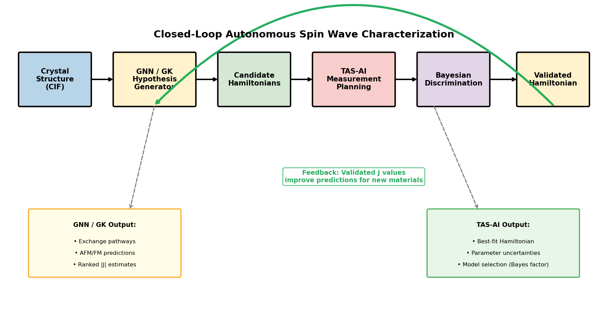{ width=6in }

**Figure 1.** Hybrid TAS-AI workflow. The controller begins with agnostic Log-GP mapping to localize signal, hands off to physics-informed discrimination/refinement once structure is detected, and uses motion-aware sequencing to optimize wall-clock time. An optional constrained audit layer can request targeted falsification probes under the same kinematic and safety constraints enforced by the numerical planners.

### 2.2 Sequential decision problem

Consider a magnetic material with an unknown Hamiltonian model $M$ and unknown parameter vector $\theta$ (e.g., $J_1$, $J_2$, and $D$). The autonomous experiment collects a sequence of measurements

$$
\mathcal{D}_N = \{(Q_i,E_i,I_i,\sigma_i,t_i)\}_{i=1}^{N},
$$

where $Q_i$ and $E_i$ are the measured momentum-energy coordinates, $I_i$ is the observed intensity, $\sigma_i$ is the corresponding uncertainty estimate, and $t_i$ is the counting time. The controller must infer both the discrete model identity and the continuous parameter posterior while minimizing total wall-clock time.

The controller therefore seeks a policy

$$
\pi : \mathcal{D}_N \mapsto (Q_{N+1},E_{N+1},t_{N+1})
$$

that maps the current data set to the next momentum-energy point and count time. In the hybrid workflow this policy is not fixed: discovery and inference are handled by different controllers because the utility functions are different.

---

## 3. Methods

### 3.1 Agnostic discovery with enhanced Log-GP

The agnostic phase uses Gaussian-process regression in **log-intensity space**,

$$
z(Q,E)=\log[I(Q,E)+\epsilon],
$$

where $I(Q,E)$ is the scattering intensity and $\epsilon$ is a small positive offset that regularizes the transform in low-count regions. Following the neutron-spectroscopy reconstruction framework of Teixeira Parente *et al.*[@teixeiraparente2023natcomms; @teixeiraparente2022front], this guarantees non-negative predictions after exponentiation and is well suited to sparse discovery of unknown signal support.

In practice, raw log-space variance maximization exhibits a boundary failure mode: GP variance peaks at the edges of a bounded domain, and log-variance treats dim background regions as equally valuable as bright signal regions. For the agnostic discovery phase, we therefore wrap the base Log-GP regression in four additional safeguards to produce what we call the **enhanced Log-GP** discovery policy:

1. a small coarse initialization grid,
2. linear-intensity variance weighting for acquisition,
3. consumed-area exclusion using resolution-sized ellipses, and
4. a soft one-dimensional energy taper to suppress edge-locking.

These modifications leave the method model agnostic while making it behave like a realistic neutron-mapping policy rather than an unconstrained variance maximizer. In the current implementation, candidate scoring uses linear-space variance proxies exposed by the surrogate backend; when log-space mean and variance are directly available, this can be written as the usual log-normal conversion detailed in Supplementary Note S1, where the taper is also described.

Throughout the paper we distinguish this **enhanced Log-GP** policy (used in the full hybrid workflow of Figures 9 and 10 and in the blind-reconstruction benchmarks of Table 1) from a **bare Log-GP** variant that uses only the underlying log-space GP regression without the taper, clamp, or consumed-region safeguards. The bare variant appears in the audit ablation benchmarks (Tables 4 and 5), where a simpler explorer suffices to test the lock-in failure mode in a controlled setting.

### 3.2 Physics-informed acquisition for parameter refinement

The handoff from agnostic discovery to physics-informed inference is triggered automatically once the discovery stage has identified a localized candidate signal region sufficient to instantiate the physics model on a restricted action set; in the present implementation this is a heuristic rule based on the seeded coarse survey plus the first active Log-GP localization step, after which the controller switches to motion-aware local exploration and Hamiltonian-aware refinement. The acquisition function ranks candidate measurements by expected information gain per unit wall-clock time:

$$
\alpha(Q,E)=\frac{[\mathrm{InfoGain}(Q,E)]^\gamma}{\mathrm{CountTime}(Q,E)+\mathrm{MoveTime}(Q,E)},
$$

where $\alpha(Q,E)$ is the acquisition score, $\mathrm{InfoGain}(Q,E)$ is the expected local information gain at the candidate point, $\mathrm{CountTime}(Q,E)$ is the estimated counting time, and $\mathrm{MoveTime}(Q,E)$ is the corresponding motor-motion overhead. The exploration exponent $\gamma = 0.7$ is used throughout as a stable default within the tested range $\gamma \in \{0.5, 0.7, 0.9\}$ (Supplementary Note S3.2).

Inside the real-time loop, the posterior is approximated locally as Gaussian. For covariance matrix $\Sigma$ and measurement uncertainty $\sigma$, the expected information gain is approximated by

$$
\mathrm{InfoGain}\approx \frac{1}{2}\log\!\left[1+\frac{1}{\sigma^2}
\left(\frac{\partial S}{\partial \theta}\right)^\mathsf{T}
\Sigma
\left(\frac{\partial S}{\partial \theta}\right)\right].
$$

Here $S(Q,E;\theta)$ denotes the forward-model intensity at the candidate point, $\partial S/\partial\theta$ is its parameter gradient, $\Sigma$ is the local posterior covariance of the parameter vector $\theta$, and $\sigma$ is the predicted observation uncertainty at that point. This Laplace-style approximation is fast enough for in-loop ranking of many candidate points. More expensive MCMC updates are reserved for batch boundaries or offline validation when local diagnostics fail. We note that the resulting uncertainty intervals are useful as fast local surrogates for measurement ranking and routing, but they are not calibrated Bayesian credible intervals: empirical coverage in the refinement benchmark is substantially below nominal (Supplementary Note S3.4).

### 3.3 In-loop model discrimination

To discriminate among competing Hamiltonians $M_k$, TAS-AI maintains model scores

$$
P(M_k\mid \mathcal D) \propto P(\mathcal D\mid M_k)\,P(M_k).
$$

Here $\mathcal D$ denotes the current accumulated data, $P(\mathcal D\mid M_k)$ is the model evidence term for candidate Hamiltonian $M_k$, and $P(M_k)$ is its prior weight. Because rigorous marginal likelihood estimation is too expensive for a sub-second loop, we use **AIC-weight ratios** as a pragmatic real-time proxy:

$$
w_k \propto \exp\!\left(-\frac{\mathrm{AIC}_k}{2}\right),
\qquad
R_{ij}^{\mathrm{AIC}}=\frac{w_i}{w_j}.
$$

Here $w_k$ is the normalized relative weight of model $M_k$, and $R_{ij}^{\mathrm{AIC}}$ is the evidence ratio comparing models $M_i$ and $M_j$. The AIC itself is approximated as

$$
\mathrm{AIC}_k = \chi^2_k + 2p_k,
$$

where $\chi^2_k$ is the weighted least-squares misfit of model $M_k$ to the current data and $p_k$ is the number of free parameters in that model.[@akaike1974] We originally tested BIC, but in sequential settings the increasing sample count changes the BIC penalty term $p_k \ln n$ even when newly added measurements mostly reinforce already identified features rather than opening a genuinely new model-selection regime.[@schwarz1978] The issue is not that $\chi^2$ stops dominating the absolute scale, but that the relative complexity penalty drifts with $n$ in a way that is awkward for a real-time controller comparing models after each small batch. AIC keeps the complexity penalty fixed and therefore behaves more predictably as an engineering proxy for in-loop discrimination. Throughout the paper, "decisive" evidence refers to **AIC-derived evidence ratios** exceeding 100, using the Kass–Raftery Bayes-factor scale only as a heuristic reference rather than as a claim of formal marginal-likelihood evaluation.[@kass1995]

Chemically informed priors are motivated by Goodenough–Kanamori heuristics. In the square-lattice test case, the prior weights are initialized as $[0.10,0.10,0.10,0.70]$ for $\{\mathrm{NN},\mathrm{NN{+}D},J_1\!-\!J_2,\mathrm{Full}\}$. This prior accelerates discrimination but also shapes it; a sensitivity analysis appears in §5.4 and Supplementary Note S5.4.

During the discrimination phase, nuisance background terms are frozen at values estimated during discovery. This prevents gapless hypotheses from absorbing weak gap signal into floating offsets and artificially improving their AIC scores.

### 3.4 Algorithmic myopia and silent-data failure

Posterior-weighted acquisition can fail even when the underlying physics model is expressive enough. The problem is not numerical instability but **algorithmic myopia**. If an incorrect model takes an early lead, the planner may keep selecting high-intensity points that refine that model rather than low-intensity points that could overturn it.

In our gapped-versus-gapless closed-loop tests, this occurs when the queue dwells inside the expected gap. Both the gapped model and gapless competitors predict near-zero intensity there within experimental error, so the measurements contribute little discriminative information. Because those silent data points are also cheap to fit under simpler models, AIC-weighted planning can delay the very gap-sensitive probes needed to falsify the wrong hypothesis. We refer to this failure mode as **silent-data posterior lock-in**. Here, by **silent data** we mean measurements whose observed intensity is near zero across multiple competing hypotheses and therefore carries little model-discriminative information. As formally derived in Supplementary Note S4, the local Laplace approximation of parameter information systematically suppresses the cross-model log-likelihood ratio once a false leader dominates the posterior, so the refinement utility on the bright branch overwhelms the falsification value of an under-sampled weak feature even when the latter is kinematically accessible.

Two mitigations are used in the numerical loop itself:

1. **contrast-aware selection**, which explicitly rewards regions where competing models separate, and  
2. **forced diagnostic coverage**, such as high-symmetry seed points, to ensure the queue contains early falsification probes.

Section 5 describes a more flexible audit layer that operates on top of these numerical mitigations.

### 3.5 Instrument model, resolution, and uncertainty

All simulations use realistic thermal-neutron TAS parameters representative of modern triple-axis spectrometers. We assume fixed final energy $E_f=14.7$ meV, realistic horizontal and vertical collimations, PG(002) monochromator/analyzer optics, and standard kinematic accessibility constraints.

Energy broadening is computed from the Cooper–Nathans resolution formalism.[@coopernathans1967a; @coopernathans1968b] At each candidate point $(Q,E)$ we evaluate the resolution matrix, extract the energy full width at half maximum, convert it to Gaussian width $\sigma_E$, and broaden the model in energy rather than performing a full four-dimensional convolution. This approximation captures the dominant effect relevant to point-by-point planning while remaining computationally lightweight. On steep dispersive branches, however, neglecting the full $Q$-$E$ coupling can modestly underestimate apparent linewidths relative to a full 4D resolution treatment.

Synthetic data combine Poisson counting noise with a conservative 3% systematic floor,

$$
\sigma_{\mathrm{sys}} = 0.03\,I + 10^{-4},
$$

where $I$ is the predicted or observed local intensity in the simulator. This floor prevents extremely bright points from dominating the likelihood because of minor resolution mismatches.

### 3.6 Spin-wave models, backends, and benchmark provenance

For the analytic benchmarks we use a square-lattice ferromagnet with nearest-neighbor exchange $J_1$, next-nearest-neighbor exchange $J_2$, and easy-axis anisotropy $D$,

$$
\mathcal H = -J_1\sum_{\langle i,j\rangle}\mathbf S_i\cdot \mathbf S_j
            -J_2\sum_{\langle\langle i,j\rangle\rangle}\mathbf S_i\cdot \mathbf S_j
            -D\sum_i (S_i^z)^2.
$$

Here $\mathbf S_i$ is the spin operator on site $i$, $\langle i,j\rangle$ denotes nearest-neighbor pairs, $\langle\langle i,j\rangle\rangle$ next-nearest-neighbor pairs, $J_1$ and $J_2$ are the exchange constants, and $D$ is the single-ion anisotropy. With the sign convention above, positive $J_1$ and $J_2$ correspond to ferromagnetic exchange because the Hamiltonian carries explicit leading minus signs. Along the measured $[H,H,0]$ cut, the one-magnon branch is

$$
\omega(H) = 2S\left[2J_1(1-\cos 2\pi H) + 2J_2(1-\cos^2 2\pi H)\right] + D(2S-1).
$$

where $S$ is the spin quantum number and $H$ is the reduced reciprocal-lattice coordinate along the scan. The dynamical structure factor is modeled as a Lorentzian centered on the dispersion,

$$
S(Q,E)=\frac{A\eta}{(E-\omega(Q))^2+\eta^2}\,n(E,T)+\mathrm{background},
$$

where $A$ is an overall intensity scale, $\eta$ is the linewidth, $n(E,T)$ is the thermal occupation factor, and `background` denotes an additive offset term. This form is fast enough for real-time use in the analytic loop.

The closed-loop audit-layer pilots use a separate square-lattice antiferromagnetic $J_1$-$J_2$-$D$ model referenced to the ordering vector $\mathbf Q_{\mathrm{AF}}=(0.5,0.5,0)$:

$$
\omega(\mathbf q)=\sqrt{A_{\mathbf q}^2-B_{\mathbf q}^2},
\qquad
A_{\mathbf q}=4SJ_1-4SJ_2(1-\gamma_2)+D(2S-1),
\qquad
B_{\mathbf q}=4SJ_1\gamma_1,
$$

where $\mathbf q$ is measured relative to the ordering vector, $A_{\mathbf q}$ and $B_{\mathbf q}$ are the standard linear-spin-wave coefficients, and $S$ again denotes the spin quantum number. As in the ferromagnetic case, the single-ion anisotropy enters as the exact linear-spin-wave shift $D(2S-1)$, which vanishes for $S=\tfrac12$. We use $\gamma_1=\tfrac12[\cos(2\pi q_h)+\cos(2\pi q_k)]$ and $\gamma_2=\cos(2\pi q_h)\cos(2\pi q_k)$ for $q_h=q_k=H-0.5$.

At the software level, TAS-AI supports three backend families:

1. **built-in analytical Python models** for rapid real-time operation,
2. **PySpinW** for SpinW-compatible calculations in more complex Hamiltonians,[@toth2015] and
3. **Sunny.jl** as an optional advanced backend.[@dahlbom2025sunny]

Most results in this paper use the built-in analytical models. The main exceptions are the analytic TAS-AI physics-only rows in the blind benchmark table, which were run with a Sunny square-lattice backend, and the PySpinW ground-truth benchmarks, which use PySpinW-generated data plus corresponding TAS-AI runs. 

### 3.7 Motion-aware sequencing and MCTS batch planning

Motor motion enters the objective through the time denominator of the acquisition score. For simplified $(H,E)$ trajectories, move time is modeled as

$$
\mathrm{MoveTime}
=
\max\!\left(\frac{|\Delta H|}{v_H}, \frac{|\Delta E|}{v_E}\right)
+
t_{\mathrm{overhead}},
$$

where $\Delta H$ and $\Delta E$ are the proposed motor moves in reciprocal-lattice and energy coordinates, $v_H$ and $v_E$ are the corresponding motor speeds, and $t_{\mathrm{overhead}}$ is a fixed settling/readout overhead. This term converts information gain into **information rate**, which is the quantity relevant to scarce beam time.

The default queue builder is greedy and one-step. When measurements are executed in short batches, however, trajectory ordering becomes path dependent. TAS-AI therefore includes an optional **Monte Carlo Tree Search** batch planner that evaluates short sequences and optimizes information gained per total time.[@kocsis2006uct; @browne2012mcts]

---

## 4. Results

### 4.1 Blind reconstruction shows why hybrid autonomy is necessary

We first evaluate the setting in which the controller is effectively blind: it must discover the topology of the response surface before any trustworthy model-based planning is possible. Figure 2 shows the synthetic benchmark families and Figures 3–4 summarize the analytic and PySpinW ground-truth benchmark results.

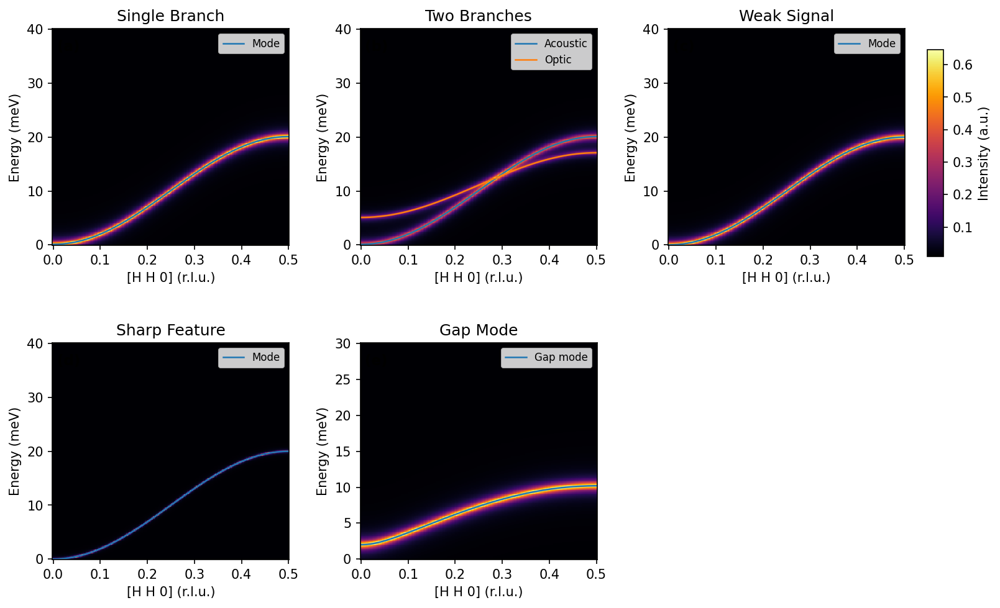{ width=6in }

**Figure 2.** Synthetic benchmark scenarios used to test discovery-oriented behavior: single branch, two branches, weak signal, sharp feature, and gap mode.

Table 1 reports the unified fair-benchmark summary. The reconstruction metric is a truth-weighted mean absolute error evaluated on a fixed reference grid in $(H,E)$ space, normalized so that a perfect reconstruction scores zero and larger values indicate worse coverage (the precise formula and implementation details are given in Supplementary Note S2.1). A run is counted as successful when this error falls below 0.20 within the measurement budget. The important point is not which method is "best" in the abstract, but **which task is being measured**. The global reconstruction metric primarily rewards broad discovery coverage, so agnostic methods should be expected to perform well. That is exactly what we observe in the analytic suite: grid, random, and enhanced Log-GP usually cross the global error threshold faster and more reliably than physics-only TAS-AI.

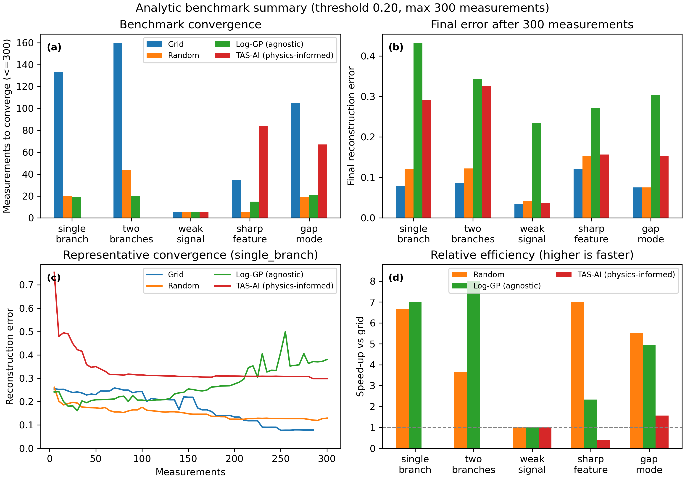{ width=6in }

**Figure 3.** Analytic blind-reconstruction benchmarks. Agnostic methods are favored by the global reconstruction metric because they are optimized for discovery rather than for parameter inference.

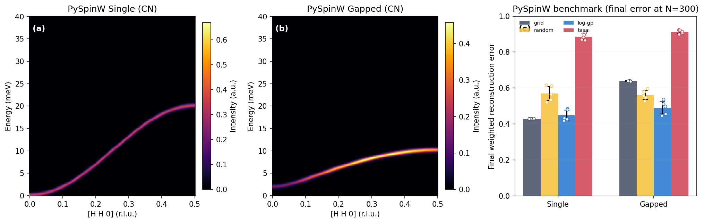{ width=6in }

**Figure 4.** PySpinW ground-truth benchmarks with Cooper–Nathans-derived energy broadening. Panels (a) and (b) show the two benchmark surfaces. Panel (c) reports mean final weighted reconstruction error after 300 measurements, with individual seed values overlaid. Under this stricter realism-heavy whole-window benchmark, none of the methods reaches the 0.20 threshold within budget; enhanced Log-GP is competitive with grid on the gapless case and performs best on the gapped case, while physics-only TAS-AI performs poorly on this blind global-mapping objective.

*Table 1.* Fair benchmark summary with unified method settings. Each cell reports success rate (X/5), median measurements-to-threshold among successful runs [IQR], and mean final error at budget across all runs. Entries such as `5 [5-5]` indicate that the successful runs all reached threshold at the same measurement count, so the IQR collapses to a single value. `N/A` indicates that no run reached the reconstruction threshold within the fixed budget, so the median measurements-to-threshold is undefined; in those cases, the informative quantity is the final error at budget. Analytic rows use threshold 0.20 and budget $N=300$. For the corrected PySpinW+Cooper-Nathans rows, no method reaches the 0.20 threshold within budget. These results quantify **blind reconstruction**, not downstream parameter inference.

| **Benchmark scenario**     | **Grid (succ; med [IQR]; err)** | **Random**             | **Log-GP (enhanced)**  | **TAS-AI (physics-only)** |
| -------------------------- | ------------------------------- | ---------------------- | ---------------------- | ------------------------- |
| single_branch              | 5/5; 140 [140-140]; 0.079       | 5/5; 15 [10-20]; 0.122 | 5/5; 20 [20-20]; 0.433 | 5/5; 85 [75-90]; 0.160    |
| two_branches               | 5/5; 160 [160-160]; 0.087       | 5/5; 35 [30-35]; 0.122 | 5/5; 20 [20-20]; 0.343 | 5/5; 150 [80-175]; 0.137  |
| weak_signal                | 5/5; 5 [5-5]; 0.034             | 5/5; 5 [5-5]; 0.042    | 5/5; 5 [5-5]; 0.234    | 5/5; 5 [5-5]; 0.074       |
| sharp_feature              | 5/5; 35 [35-35]; 0.122          | 5/5; 5 [5-5]; 0.152    | 5/5; 15 [15-15]; 0.271 | 5/5; 80 [68-150]; 0.173   |
| gap_mode                   | 5/5; 105 [105-105]; 0.075       | 5/5; 15 [15-15]; 0.076 | 4/5; 22 [10-25]; 0.303 | 1/5; 70 [70-70]; 0.200    |
| pyspinw_single (CN, N=300) | 0/5; N/A; 0.430                 | 0/5; N/A; 0.571        | 0/5; N/A; 0.449        | 0/5; N/A; 0.885           |
| pyspinw_gapped (CN, N=300) | 0/5; N/A; 0.639                 | 0/5; N/A; 0.562        | 0/5; N/A; 0.490        | 0/5; N/A; 0.913           |

This result is evidence that **discovery and inference are different objectives**. A planner optimized for parameter information rate is not the right tool for blind global mapping --- and that separation is precisely the reason the hybrid workflow exists.

### 4.2 Physics-informed planning and motion-aware scheduling

Figure 5 shows the controlled time-aware parameter-refinement study. Here the Hamiltonian family is assumed known and the problem is no longer blind discovery but parameter contraction under a realistic wall-clock budget. The figure should therefore be read as a refinement-stage demonstration. In this setting TAS-AI behaves as intended: it reaches the target RMS threshold after 8 measurements and about 170 s of elapsed experiment time, whereas the best competing method in the representative run (random) reaches the same threshold only after 17 measurements and about 542 s.

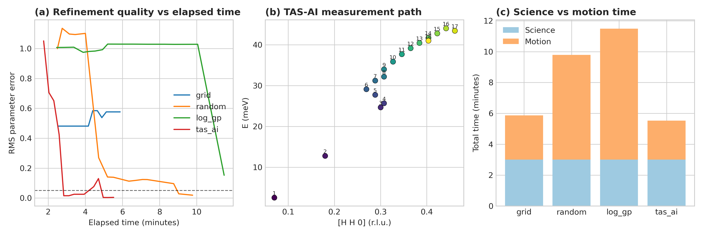{ width=6in }

**Figure 5.** Controlled time-aware parameter-refinement study for the square-lattice ferromagnet. Once the model family is fixed, the motion-aware physics-informed planner reaches the RMS threshold earliest by prioritizing parameter-sensitive measurements with high information rate. Panel (a) shows RMS error versus elapsed experiment time, panel (b) shows the TAS-AI path through $(H,E)$ space, and panel (c) separates science counting from motion overhead. In the representative run shown here, TAS-AI reaches threshold in 170 s while the random baseline does so only after 542 s; grid and Log-GP do not converge within the same budget.

Figure 6 then shows the in-loop NN-vs-$J_1$-$J_2$ discrimination test. The controller reaches decisive AIC-derived evidence within the first few batch updates by selecting points near the band edge and the intermediate-$H$ shoulder where the models separate most strongly.

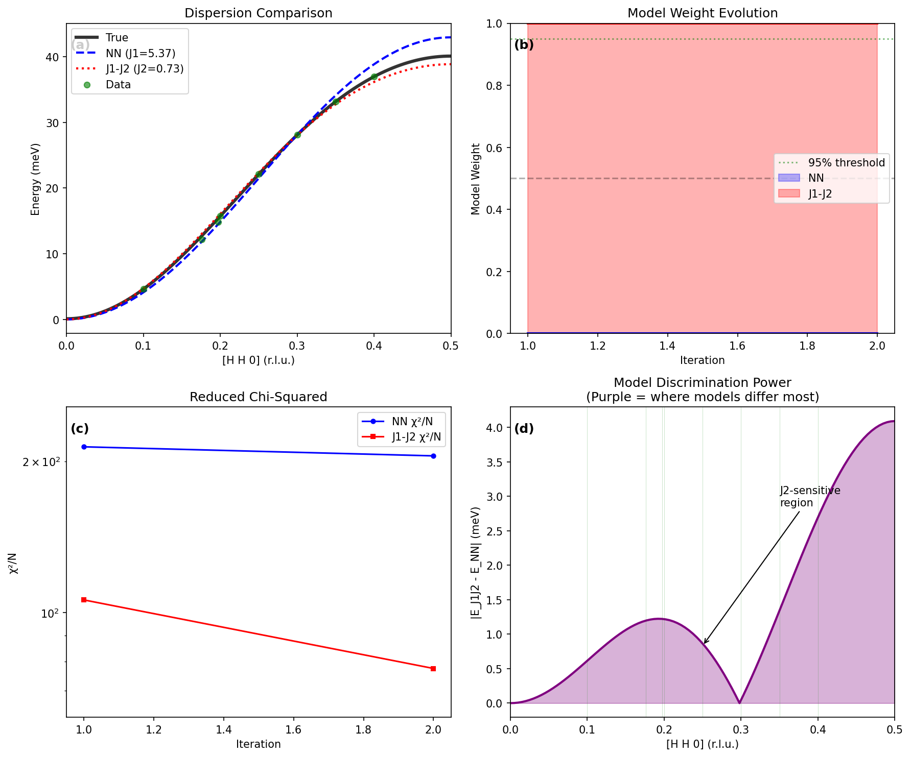{ width=6in }

**Figure 6.** In-loop Hamiltonian discrimination. The x-axis counts cumulative measurements, including the seeded points used to initialize the comparison; thus the decisive jump occurs within eight total measurements rather than eight post-seed updates. The AIC-derived evidence ratio becomes decisive in the representative run because the planner targets the regions where the competing dispersions diverge most strongly. In panel (d), the green vertical guides mark the measurement locations used for the corresponding discrimination trace.

The speed of this discrimination depends on the chemically informed prior (§3.3); with flat priors the correct model is still identified, but more measurements are needed to reach the decisive threshold (Supplementary Note S5.4).

This result illustrates the central design principle: once discovery has done its job, model-aware planning is no longer competing on the same axis as a global mapper. It is competing on the axis that matters for physical interpretation --- how fast the experiment can determine the correct model and tighten the relevant posteriors.

An autonomous loop that optimizes information gain without accounting for instrument motion can still waste beam time. Figure 7 and Table 2 isolate this effect in a **controlled scheduling study**: all methods are given the same fixed set of scientifically relevant candidate measurements, and only the ordering policy varies. Motion-aware ordering reduces total run time from 88 minutes to 60 minutes for the same 50 minutes of science counting.

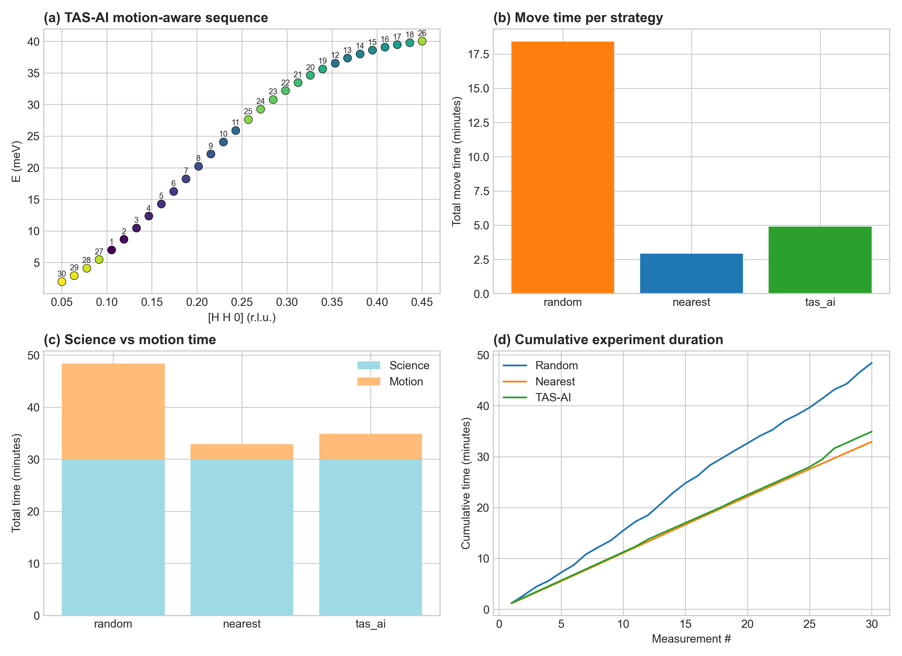{ width=6in }

**Figure 7.** Controlled motion-aware scheduling diagnostics on a fixed candidate set. Panel (a) shows the fixed candidate measurements colored by their position in the executed schedule, so the color scale encodes traversal order rather than intensity. Panels (b)-(d) then separate the corresponding cumulative path length, elapsed time, and per-point timing summaries. The figure is intended as a scheduling diagnostic, not as a second benchmark of adaptive discovery.

*Table 2.* Motion-aware scheduling timings for the controlled fixed-candidate scenario in Figure 7. This table isolates route-ordering effects rather than benchmarking full adaptive discovery policies.

| **Strategy**     | **Science Time** | **Move Time** | **Total** | **Efficiency** |
| ---------------- | ---------------- | ------------- | --------- | -------------- |
| Random order     | 50 min           | 38 min        | 88 min    | 57%            |
| Nearest neighbor | 50 min           | 22 min        | 72 min    | 69%            |
| TAS-AI optimized | 50 min           | 10 min        | 60 min    | 83%            |

This effect is not a secondary implementation detail. On a TAS instrument, a 30–60 s move can be comparable to a 60 s count, so wall-clock throughput depends on both the physics utility and the route taken through phase space.

Batched trajectories introduce an additional path dependence. Figure 8 shows that MCTS outperforms one-step greedy ordering in motion-dominated regimes by explicitly evaluating short candidate sequences. A systematic multi-seed evaluation of the MCTS benefit across broader motion models and batch horizons is beyond the scope of this paper but is a natural follow-up.

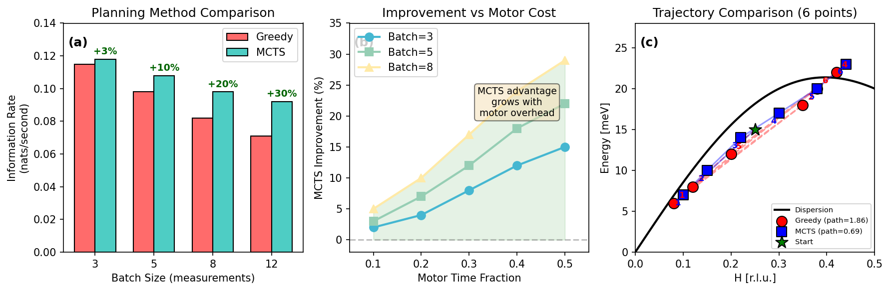{ width=6in }

**Figure 8.** MCTS batch planning reduces path inefficiency relative to one-step greedy ordering when motion dominates the cost budget.

### 4.3 The full hybrid handoff in an integrated run

The core design principle of the paper is best seen in a single integrated run. Figure 9 shows the handoff from enhanced Log-GP discovery to physics-informed inference, with checkpoints saved at each controller-phase boundary. The archived run uses a fixed three-phase schedule for exposition — 13 coarse grid points, 15 enhanced Log-GP active points, then physics refinement from measurement 29 — so that the control transition is visible at a glance; the automatic handoff trigger of §3.2 selects a similar transition point from the same seeded survey. The posterior remains non-decisive through the agnostic stage and sharpens to decisive support for the full model only once physics refinement begins. The posterior evolution is phase-labeled so the reader can see that the control logic is not monolithic: the system changes acquisition strategy as the task changes.

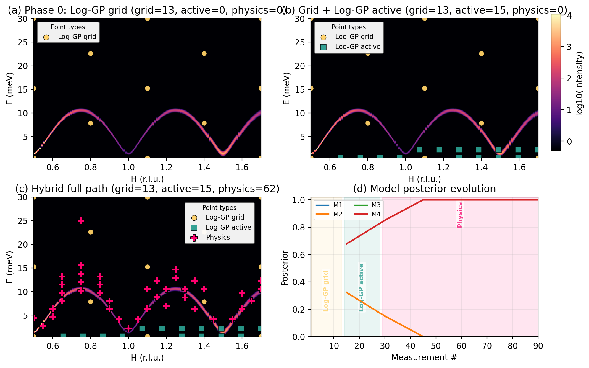{ width=6in }

**Figure 9.** Hybrid handoff from agnostic discovery to physics-informed inference. The agnostic front end uses the enhanced Log-GP policy (§3.1). In panel (d), the colored vertical bands mark the contiguous controller phases: coarse grid discovery, active Log-GP remapping, and physics-informed refinement. The figure makes the control transition explicit rather than mixing all points into a single trajectory.

This integrated run is the clearest evidence for the manuscript's main thesis: the agnostic front end is not an auxiliary convenience, and the physics-informed back end is not a drop-in replacement for discovery. The power comes from **deploying each controller in the regime where its inductive bias matches the task**.

### 4.4 Computational performance

The core algorithmic components of TAS-AI operate comfortably within real-time beamline latencies. Typical per-iteration timings are approximately 0.5 ms for dispersion evaluation over 100 points, 2 ms for intensity calculation, 10 ms for acquisition optimization, 100 ms for fast local fitting, and 500 ms for a heavier 1000-sample MCMC stage when triggered.

The distinction between algorithmic and benchmark-harness timing matters. The **sub-second** timing refers to the inference and planning latency of the numerical controller itself. Supplementary Table S1 instead reports planner-side `mean_time_per_suggestion` for the benchmark harness: approximately `0.85--0.97 s` for enhanced Log-GP and `0.016 s` for TAS-AI (physics). Both are relevant: the former for real beamline feasibility, the latter for reproducibility and benchmark cost accounting.

We now turn to a qualitatively different challenge: what happens when the posterior-weighted planner itself becomes the bottleneck to correct model selection.

---

## 5. Mitigating algorithmic myopia via strategic audit

Having identified silent-data posterior lock-in in §3.4, we now present a constrained audit layer designed to mitigate it. The section describes the implementation (§5.1), reports a pilot closed-loop demonstration (§5.2), and presents two controlled ablation benchmarks that isolate the lock-in failure mode (§5.3).

### 5.1 Constrained LLM oversight

In the present implementation, the audit role is instantiated by an **LLM committee** operating under strict constraints. The committee does not see the full hidden numerical state of the planner. Instead it receives a compact prompt packet containing only the information needed for strategic auditing: a short recent-history table of measured $(H,E,I)$ points; the current measurement count and batch index; the allowed mode choices; a narrow description of the current ambiguity (generated automatically from loop state, not typed by a human during the run); and the hard execution constraints. Those constraints include the allowed reciprocal-space window, the allowed energy window, the requirement that responses be returned as strict JSON, and the rule that the committee may not alter likelihoods, fit models, or override kinematic vetoes.

The committee is then allowed to do only two things:

1. choose the next **mode** (`loggp_active` or `physics`), and/or  
2. nominate a **small number of tactical audit points** from the bounded candidate menu already constructed by the numerical planner.

Operationally, two proposer models generate independent candidate JSON payloads from the same redacted prompt, and a third decider model selects between them or falls back to the safest valid option. The LLM therefore does not emit arbitrary continuous instrument coordinates; it chooses among bounded routing options and menu-listed audit probes that have already passed the numerical guardrails. In the current watcher implementation, the provider pool is Claude Code (default model: Opus 4.5), Gemini CLI (default model: Gemini 3), and Codex CLI pinned to `gpt-5.2-codex`; the decider rotates across those providers by batch unless explicitly pinned, to reduce stylistic bias and provide failure containment. Additional reproducibility details are given in Supplementary Note S5.

Everything else remains symbolic and numerical. The LLM does **not** fit Hamiltonians, update model weights, alter the likelihood, bypass kinematic checks, or reorder the entire queue. The Bayesian engine still computes the posteriors, and the instrument planner still enforces all accessibility and safety constraints. The LLM therefore functions as a **strategic auditor**, not as a replacement for the inference loop.

This division of labor keeps the system scientifically interpretable while allowing a flexible source of tactical hypotheses when the internal utility becomes too self-confirming. In effect, the audit layer can say: *before spending another batch exploiting the current leader, allocate one or two measurements to the falsification probes that the greedy utility is currently underweighting.*

### 5.2 Pilot closed-loop demonstration

Figure 10 shows a full 90-measurement closed-loop run with the LLM audit layer active. The test system is a square-lattice AFM $J_1$-$J_2$-$D$ model centered on $\mathbf Q_{\mathrm{AF}}=(0.5,0.5,0)$ with four nested candidates: NN-only ($M_1$), NN+$D$ ($M_2$), NN+$J_2$ ($M_3$), and the full $J_1$+$J_2$+$D$ model ($M_4$). The synthetic data are generated from $M_4$. Starting from the enhanced Log-GP coarse grid and active warm start, the overseer alternates between agnostic remapping and physics batches while remaining inside the same constraints as the non-LLM loop. The final fit selects the full model decisively (Table 3).

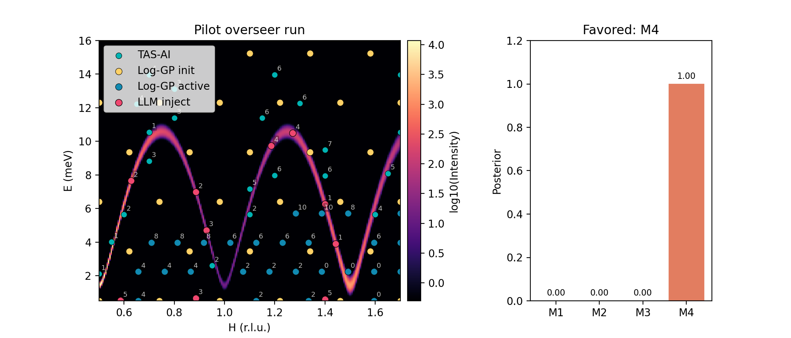{ width=6in }

**Figure 10.** Pilot LLM-audited closed-loop run (90 measurements). The left panel shows the executed measurements over the synthetic intensity map, with enhanced Log-GP grid, enhanced Log-GP active, and physics points shown separately. The right panel shows the final model posteriors. The overseer operates only at the routing layer while preserving the same numerical posteriors, kinematic constraints, and safety checks as the non-LLM loop.

*Table 3.* Closed-loop pilot fit summary. Uncertainties are Laplace approximations from the local Hessian; empirical coverage is substantially below nominal (Supplementary Note S3.4), so these should be read as local error surrogates rather than calibrated credible intervals.

| **Scenario**             | **N** | **M4 posterior** | **J₁ (meV)**    | **J₂ (meV)**    | **D (meV)**       | **Bkg (arb.)** |
| ------------------------ | ----: | ---------------: | --------------- | --------------- | ----------------- | -------------- |
| True                     |   —   |              —   | 1.25            | 0.20            | 0.020             | 0.50           |
| Non-LLM (no symmetry)    |   87  |          >0.999  | 1.247 ± 0.004   | 0.198 ± 0.004   | 0.0201 ± 0.0001   | 0.476 ± 0.011  |
| Symmetry-seeded (no LLM) |   86  |          >0.999  | 1.250 ± 0.004   | 0.199 ± 0.004   | 0.0199 ± 0.0001   | 0.485 ± 0.010  |
| LLM-audited (no symmetry)|   90  |          >0.999  | 1.256 ± 0.010   | 0.206 ± 0.009   | 0.0211 ± 0.0007   | 0.485 ± 0.010  |

The purpose of this pilot is to demonstrate that the audit layer integrates into the full workflow without degrading model selection or parameter recovery. All three runs reach decisive support for $M_4$. The LLM-audited run shows modestly wider parameter uncertainties (e.g., $\pm 0.010$ vs. $\pm 0.004$ on $J_1$) because the overseer diverts some measurements toward falsification probes rather than parameter refinement — a deliberate trade-off between refinement precision and model-selection robustness that the ablations in §5.3 examine in more detail.

### 5.3 Escaping posterior lock-in: targeted ablations

The pilot demonstration shows that the audit layer integrates into the full workflow. We now isolate the lock-in failure mode directly through two controlled ablation benchmarks of increasing physical complexity.

#### 5.3.1 Ghost-optic ablation

The first ablation uses a deliberately minimal fixed-$Q$ analytic benchmark in which the current Bayesian leader is a one-branch model while the true spectrum contains an additional weak secondary branch carrying only a small fraction of the dominant spectral weight. Concretely, the ghost-optic benchmark is a fixed-$Q$ two-Lorentzian toy spectrum over $E\in[0,20]$ with a dominant acoustic peak at $E=5$, a weak optic peak at $E=15$ carrying 5% of the acoustic amplitude, shared linewidth $\gamma=0.5$, and additive background 0.1; the comparator omits the optic term. The common seed samples only the bright acoustic peak at $E=\{4.25,4.75,5.25,5.75\}$, leaving the optic region initially untested.

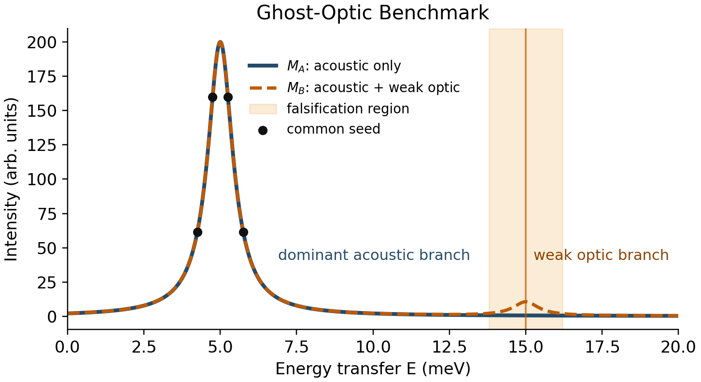{ width=6in }

**Figure 11.** Ghost-optic benchmark schematic used in the Section 5.3.1 audit ablation. The acoustic-only comparator ($M_A$) and the acoustic+optic truth ($M_B$) agree on the dominant bright branch near $E=5$ but differ through a weak secondary optic feature near $E=15$. Black markers show the common seed measurements, which cover only the acoustic branch and therefore leave the falsification region initially untested.

From that common seed, we compare four policies:

- `None`: fixed seed followed by pure refinement of the current leader.
- `Log-GP`: fixed seed followed by a 1D GP variance explorer, that is, the bare Log-GP variant (§3.1), without the taper/clamp safeguards of the enhanced policy.
- `Max-disagreement`: a deterministic top-two falsification rule that selects the kinematically accessible candidate with the largest intensity disagreement between the current leading and runner-up models, subject to the same bounded menu and injection budget as all other policies.
- `LLM`: fixed seed followed by the same refinement loop plus the LLM audit layer, using the same shared candidate menu and strict JSON contract as the main overseer.

*Table 4.* Ghost-optic audit ablation. The benchmark uses a fixed sparse seed around the bright branch and compares a pure refinement baseline (None), a bare Log-GP explorer (Log-GP), a deterministic max-disagreement falsification rule (Max-disagreement), and the LLM audit policy (LLM). Unlike Figures 9 and 10, this benchmark does not use the full enhanced Log-GP discovery policy.

| **Policy** | **Time to decisive** | **Wrong-leader dwell** | **Falsif. fraction** | **Success** |
| ---------- | -------------------: | ---------------------: | -------------------: | ----------: |
| None       | 34                   | 25                     | 0                    | 1           |
| Log-GP     | 29                   | 20                     | 0.75                 | 1           |
| Max-disagreement | 6             | 0                      | 1                    | 1           |
| LLM        | 9                    | 0                      | 1                    | 1           |

All four one-seed policies eventually recover in this minimal analytic setting, but they do so on very different timescales. The refinement-only baseline (None) spends 25 measurements remeasuring the bright acoustic feature before reaching decisive correct selection; the bare Log-GP explorer (Log-GP) reduces that dwell by allocating more falsification-oriented batches; and both Max-disagreement and the LLM audit eliminate wrong-leader dwell entirely. The deterministic max-disagreement rule is faster than the LLM in this benchmark (decisive at 6 rather than 9 measurements), reinforcing the conclusion that the gain comes from the **falsification principle** rather than from the specific implementation. The benchmark isolates the failure mode cleanly: posterior lock-in on a bright feature delays falsification even when the missing signal is physically simple and kinematically accessible.

#### 5.3.2 Bilayer ferromagnet ablation

To move beyond the minimal ghost-optic setting, we implemented a square-lattice bilayer ferromagnet backend in which the acoustic branch remains bright while a weak $L$-suppressed optic branch provides the falsifying signal. The single-branch comparator shares the same $L$-dependent acoustic weight as the bilayer truth, so the two models differ only through the presence or absence of the optic branch. We report a separate `optic_region_hit_fraction` metric that counts batches containing at least one measurement within a narrow tolerance of the optic branch.

This benchmark uses the same shared action space as the full hybrid loop: all controllers choose between bare Log-GP remapping (`loggp_active`) and `physics` refinement, and differ only in whether that choice is made by a deterministic rule or by the LLM overseer. As in Table 4, `loggp_active` refers to the bare Log-GP variant, not the full enhanced Log-GP policy of Figures 9 and 10.

- `None`: fixed seed followed by physics refinement only.
- `Hybrid`: fixed seed followed by the shared action space (switch between `loggp_active` and `physics`), with mode chosen by a deterministic non-LLM rule and no tactical audit injections.
- `Max-disagreement`: same shared action space as Hybrid, but audit injections are selected by the deterministic top-two max-disagreement rule described in §5.3.1.
- `LLM`: fixed seed followed by the same action space, but with the LLM overseer choosing the mode and optionally adding up to two menu-selected falsification probes.

In the reported one-seed comparison, the deterministic Hybrid router uses the same menu of allowed actions and has no access to the true model. It uses simple threshold rules on posterior entropy, falsification-region coverage, and posterior margin to decide when to switch modes, with a forced periodic `loggp_active` batch to guarantee minimum exploration. The precise trigger values are given in Supplementary Note S5.

*Table 5.* Bilayer ferromagnet audit ablation using the shared action space. The falsification-probe fraction counts batches that include at least one true falsification-region measurement, whether reached incidentally by exploration or deliberately by audit injection. The optic-region-hit fraction counts batches that actually sample the weak optic branch region.

| **Policy** | **Time to decisive** | **Wrong-leader dwell** | **Falsif. fraction** | **Optic-hit fraction** | **Success** |
| ---------- | -------------------: | ---------------------: | -------------------: | ---------------------: | ----------: |
| None       | 23                   | 5                      | 0                    | 0.56                   | 1           |
| Hybrid     | 8                    | 0                      | 0.17                 | 0.50                   | 1           |
| Max-disagreement | 5             | 0                      | 0.64                 | 0.64                   | 1           |
| LLM        | 8                    | 0                      | 0.50                 | 0.50                   | 1           |

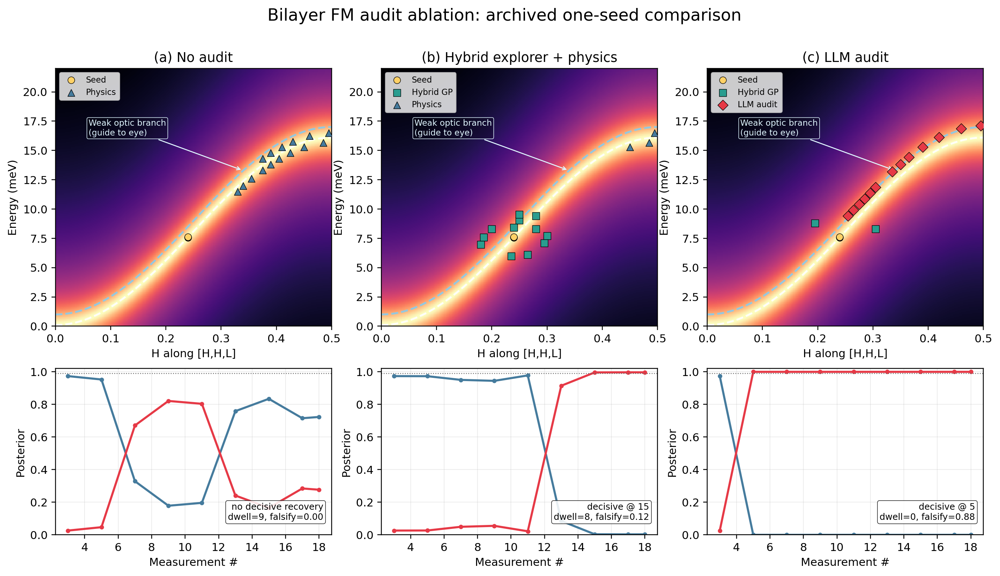{ width=6.8in }

**Figure 12.** Bilayer ferromagnet audit ablation. Top row: executed measurements over the true bilayer intensity map, with dashed guides to the bright acoustic branch and the weak optic branch (labeled as a guide to the eye because its spectral weight is intentionally small). Bottom row: reconstructed posteriors for the monolayer ($M_A$) and bilayer ($M_B$) models. In panel (a), None uses physics refinement only and eventually recovers, but only after wrong-leader dwell and later decisive selection. In panel (b), Hybrid toggles between bare Log-GP remapping and physics refinement via a deterministic rule and reaches decisive correct selection much earlier. In panel (c), the LLM overseer operates over the same mode choices and may add a bounded number of menu-selected falsification probes (red diamonds). The deterministic Max-disagreement variant reaches decisive correct selection earliest in this comparison (Table 5), while Hybrid and LLM match each other at 8 measurements.

The bilayer comparison confirms the pattern from the ghost benchmark: the falsification channel is the active ingredient. The refinement-only baseline recovers more slowly and incurs measurable wrong-leader dwell. All three falsification-capable policies—Hybrid, Max-disagreement, and LLM—remove that dwell, and the top-two Max-disagreement rule reaches decisive correct selection earliest. A five-seed rerun reported in Supplementary Note S5.2 preserves this conclusion: in both the ghost-optic and bilayer ablations, the LLM and Max-disagreement policies have identical median decisive times and zero median wrong-leader dwell. The LLM allocates a large fraction of explicit falsification batches, but this does not translate into a decisive-time advantage in the current two-model benchmark.

### 5.4 Scope and interpretation

The ghost-optic and bilayer ablations establish a clear result: **constrained falsification channels mitigate posterior lock-in**. In both benchmarks, every policy that explicitly targets falsification regions—whether a simple top-two Max-disagreement rule, a threshold-based Hybrid router, or an LLM committee—eliminates wrong-leader dwell and reaches decisive correct selection far earlier than refinement-only or undirected-exploration baselines. In these two-model settings the top-two Max-disagreement rule achieves the same outcome as the LLM under identical constraints, confirming that the active ingredient is the falsification principle rather than the specific implementation; the next paragraph notes where this parity no longer holds.

This parity is expected in the present two-model benchmarks, where the decisive falsifier always involves the current top two candidates and is therefore visible to a top-two disagreement heuristic. However, top-two disagreement is not universally sufficient. Supplementary Note S5.3 presents a targeted multi-model stress test in which the decisive falsifier separates the current leader from a lower-ranked model rather than from the runner-up. In that setting, top-two Max-disagreement is structurally blind to the critical probe, while a broader falsification policy (and the LLM) both select it correctly.

The more important question is whether hand-designed heuristics scale to the diversity of falsification geometries that arise across different Hamiltonian families. The Max-disagreement rule required choosing a specific scoring function (top-two intensity difference), a ranking priority chain, and an injection protocol; when the geometry changed in the multi-model trap, a different rule (Max-disagreement-all) was needed. Each new failure mode geometry potentially requires a new bespoke heuristic. The LLM, by contrast, operates from a *natural-language description* of the current ambiguity --- "a weak optic branch may be missing" or "the gap region is under-sampled" --- and produces reasonable audit actions from the same constrained interface without per-problem engineering. For a system designed to handle unknown Hamiltonians, which is the premise of the hybrid workflow, this generality across problem descriptions is a practical advantage that becomes more significant as the Hamiltonian family grows.

We also note that the posterior evolution in the pilot closed-loop run (Figure 10) is sensitive to the choice of prior weights: equal priors can reverse the M4/M2 ranking at intermediate measurement counts (Supplementary Note S5.4). The chemically informed prior accelerates discrimination but also shapes it, and this sensitivity should be kept in mind when interpreting the pilot results.

In summary: algorithmic myopia is real, and constrained falsification channels fix it robustly across every implementation tested. In two-model settings a simple deterministic rule suffices; in the multi-model stress test, top-two disagreement fails structurally while the LLM selects the correct probe from the same interface it used for the simpler benchmarks. That consistency across three different falsification geometries — ghost-optic, bilayer, and multi-model trap — without any per-problem re-engineering is the concrete demonstration of the generality argument. Whether that generality translates into systematic performance advantages across broader Hamiltonian families is an empirical question that the present analytic benchmarks begin to address but do not exhaust.

---

## 6. Discussion and outlook

### 6.1 Hypothesis generation from structure

The present workflow still assumes a candidate-model library. In practice, experimentalists often construct that library by inspecting the crystal structure, identifying exchange paths, and using Goodenough–Kanamori–Anderson heuristics to propose plausible Hamiltonians.[@goodenough1955; @kanamori1959; @anderson1950] Figure 13 illustrates the current hypothesis-generation blueprint used to seed the candidate list, now with explicit periodic-image path enumeration and an orbital-occupancy lookup for the Goodenough-Kanamori sign heuristic.

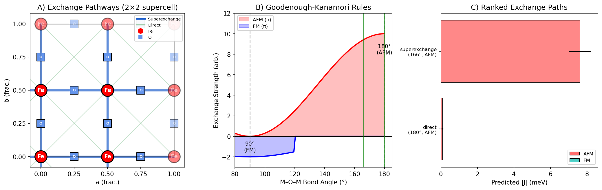{ width=6in }

**Figure 13.** Structure-derived hypothesis generation via exchange-path analysis and orbital-aware Goodenough–Kanamori heuristics. Panel A shows the periodic exchange pathways in a 2×2 supercell view, panel B summarizes the angle-based AFM/FM tendencies, and panel C ranks the resulting exchange channels by predicted strength.

Automating this step—so that TAS-AI can generate its own candidate library from a CIF file—is the natural upstream extension of the workflow. Graph neural network surrogates such as CGCNN, CHGNet, and related materials models provide a plausible long-term route,[@xie2018cgcnn; @deng2023chgnet; @chen2022m3gnet] but the present paper focuses on the downstream discrimination loop once the candidate library exists.

### 6.2 Benchmark scope, hardware deployment, and inference limitations

The benchmarks in this paper use square-lattice models with at most three exchange parameters. This choice is deliberate: simple analytic models allow the control architecture — the hybrid handoff, the myopia diagnosis, and the falsification channel — to be tested in isolation without confounding from backend complexity. The claims supported by these benchmarks are architectural (that staged control outperforms monolithic control, that falsification channels fix posterior lock-in) rather than claims about the generality of the physics models.

Establishing physics generality requires broader Hamiltonian families. The natural next benchmarks would include multi-branch dispersions where acoustic and optic modes cross or hybridize, anisotropic lattices with Dzyaloshinskii–Moriya interactions that tilt the dispersion asymmetrically, and frustrated systems (e.g., triangular or pyrochlore lattices) where multiple competing ground states produce closely spaced model candidates. In such settings the Laplace approximation may become less reliable, the candidate model space will grow, and the falsification geometry will involve more than two live hypotheses — precisely the regime where the multi-model stress test (Supplementary Note S5.3) suggests richer audit strategies are needed. TAS-AI already supports PySpinW and Sunny.jl backends that can handle these systems; the missing ingredient is the benchmark infrastructure and compute time to run controlled comparisons, not an architectural change to the controller.

The present work validates the TAS-AI architecture in a high-fidelity digital twin that includes Cooper–Nathans-derived broadening, realistic kinematics, motion costs, and counting noise. This digital-twin approach is deliberate: it allows systematic benchmarking across controlled scenarios, reproducible ablation studies, and rapid iteration on the control architecture — none of which would be feasible during scarce beam time on a live instrument. Live deployment remains the essential next step, but the architectural and algorithmic conclusions drawn here do not depend on it. The inference loop also relies on fast local approximations for tractability. Full resolution-aware MCMC with complex backends such as Sunny or PySpinW remains an important next step, especially for larger Hamiltonian families and non-Gaussian posteriors.

The path to live deployment is architecturally straightforward. On a real TAS instrument, hardware safety interlocks and collision avoidance are handled by the instrument protection system, not by the experiment control software; TAS-AI's kinematic constraints (accessible reciprocal-space window, energy limits, motor-speed bounds) are the software-level analogue and are already implemented. Motor backlash affects the optimal direction of constant-$Q$ or constant-$E$ scans and would need to be incorporated into the motion-cost model for production use, but does not change the control architecture. The main integration requirements are asynchronous I/O between the planner and the instrument control system (NICE, SICS, or equivalent), latency tolerance for the sub-second planning loop, and operator visibility into the autonomous queue. As the NIST Center for Neutron Research (NCNR) returns to scientific operations, validating the hybrid workflow on live instruments will be essential to confirming the practical gains demonstrated here.

---

## 7. Conclusions

Autonomous TAS is best understood as a **hybrid sequential design problem** rather than as a search for a single universally optimal acquisition rule. Detection, inference, and refinement are different tasks, and they reward different controllers.

This paper establishes four main results.

1. **Agnostic discovery is the correct front end for unknown spectra.** On blind global reconstruction metrics, agnostic methods outperform physics-only planning, showing why a hybrid workflow is necessary rather than optional.
2. **Physics-informed planning becomes valuable once structure is present.** In controlled benchmarks, TAS-AI rapidly contracts parameter uncertainty and reaches decisive in-loop model discrimination using AIC-derived evidence ratios as a practical real-time proxy.
3. **Time-aware planning matters experimentally.** Motion-aware acquisition and MCTS batch sequencing translate information gain into real wall-clock savings on an instrument where motor travel is often comparable to count time.
4. **Constrained falsification channels mitigate posterior lock-in.** In controlled ablations, every policy that explicitly targets falsification regions—including a simple max-disagreement rule—eliminates wrong-leader dwell and reaches decisive model selection far earlier than refinement-only baselines. The active ingredient is the falsification principle, not the specific implementation. A targeted multi-model stress test identifies a regime where top-two heuristics are structurally blind, and the LLM committee offers generality across diverse problem descriptions without per-problem engineering—an architectural advantage for systems facing unknown Hamiltonians.

As autonomous capabilities expand across neutron facilities and other user instruments, the broader design principle is clear: **agnostic controllers excel at discovery; physics-informed controllers excel at inference; and audit layers are needed when greedy utilities become self-confirming.** TAS-AI provides an open-source foundation for exploring that architecture in spin-wave spectroscopy and beyond.

---

## TOC Graphic

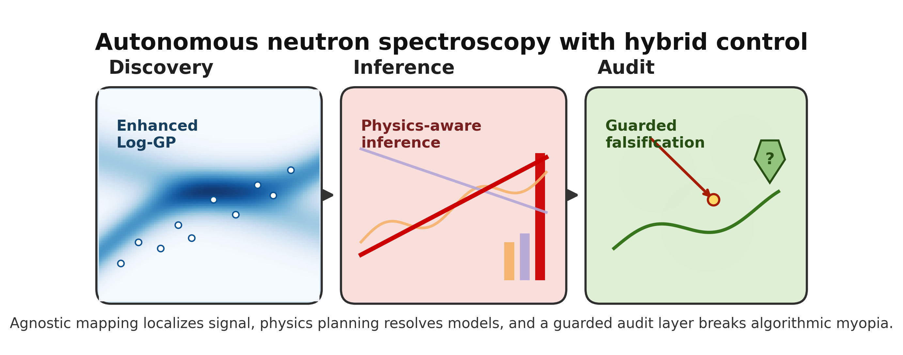

**TOC text.** TAS-AI separates autonomous neutron spectroscopy into discovery, inference, and refinement. Agnostic Log-GP mapping localizes signal, physics-informed planning performs Hamiltonian discrimination and parameter refinement, and motion-aware scheduling reduces wall-clock overhead. Constrained falsification channels break algorithmic myopia when low-intensity probes are underweighted by the Bayesian planner.

---

## Data Availability

The TAS-AI library — physics backends (including the analytic `SquareLatticeAFM` and `SquareFMBilayer` models used in the closed-loop pilots), the acquisition, instrument-resolution, and MCTS modules, and the core audit interface — is available at `https://github.com/williamratcliff-nist/tasai`. The manuscript source, figure-generation scripts, closed-loop drivers (`toy_closed_loop.py`, `run_audit_ablation.py`, and associated overseer wiring), benchmark summaries, prior specifications, and paper-specific provenance artifacts are available at `https://github.com/williamratcliff-nist/paper-tasai`. Prompt artifacts used for the pilot audit layer are described in the Supplementary Information.

## Author Contributions

W.R. conceived the project, developed the methodology, implemented the software, and wrote the manuscript.

## Conflicts of Interest

There are no conflicts to declare.

## Acknowledgements

This work used the Texas Advanced Computing Center (TACC) at The University of Texas at Austin for benchmark sweeps on Stampede3 (project CDA24014). During the preparation of this work, the author used generative AI tools for language polishing, editing, and assistance with rewriting portions of the manuscript. After using these tools, the author reviewed and edited the content as needed and takes full responsibility for the publication's content.

## References

Certain commercial equipment, instruments, or materials (or suppliers, or software, ...) are identified in this paper to foster understanding. Such identification does not imply recommendation or endorsement by the National Institute of Standards and Technology, nor does it imply that the materials or equipment identified are necessarily the best available for the purpose.

::: {#refs}
:::

```{=latex}
\clearpage
\appendix
\setcounter{secnumdepth}{3}
\renewcommand{\thesubsection}{S\arabic{subsection}}
\renewcommand{\thesubsubsection}{S\arabic{subsection}.\arabic{subsubsection}}
\renewcommand{\thefigure}{S\arabic{figure}}
\renewcommand{\thetable}{S\arabic{table}}
\renewcommand{\theequation}{S\arabic{equation}}
\setcounter{figure}{0}
\setcounter{table}{0}
\setcounter{equation}{0}
\setcounter{subsection}{0}
\setcounter{subsubsection}{0}
\section*{Supplementary Information}
\addcontentsline{toc}{section}{Supplementary Information}
```


## Supplementary Note S1. Enhanced Log-GP: the 1D taper and linear-intensity variance weighting

The underlying Log-GP reconstruction idea is due to Teixeira Parente *et al.* and the JCNS neutron active-learning work cited in the main text; it is not introduced in this manuscript. What is specific to the present implementation is the set of safeguards that stabilize the Log-GP policy for our TAS benchmark domain.

In the agnostic Log-GP phase, uncertainty sampling in **log-intensity space** can over-prioritize the boundaries of the search domain. GP predictive variance is naturally largest at the edges of a bounded box, and log-variance treats dim background regions as comparably valuable to bright signal regions. The resulting acquisition can become **edge-locked**, repeatedly sampling high-energy or high-$|H|$ boundary points that do not intersect real signal support.

We mitigate this failure mode with two complementary changes.

1. **Linear-intensity variance weighting.** Rather than ranking candidates
   by raw log-space variance alone, the acquisition is weighted by a
   linear-space variance proxy so that dim background regions are not
   treated as equally valuable as bright signal regions. When the
   surrogate exposes log-space mean and variance $(\mu, \sigma^2)$
   directly, this can be written as

$$
\mathrm{Var}(I) = \left(e^{\sigma^2}-1\right)e^{2\mu+\sigma^2},
$$

where $\mu$ and $\sigma^2$ are the GP posterior mean and variance in log-intensity space and $\mathrm{Var}(I)$ is the corresponding approximate variance in linear intensity units. In the current codebase, the live path may instead use the backend's directly exposed posterior standard deviation in linear space; the common design principle is that acquisition is ranked in linear-intensity variance units rather than raw log-space variance.

2. **A 1D cosine taper in energy.** We apply a soft window in $E$ that
   smoothly downweights the outer 10% of the energy domain while leaving the
   interior nearly unchanged.

A stronger 2D taper in both $E$ and $H$ further suppresses edge selection, but in this model it can over-penalize low-$|H|$ regions where the dispersion is strongest. We therefore retain the energy-only taper in the reported benchmarks.

{#fig:loggp-taper width=90%}

## Supplementary Note S2. Benchmark runtime accounting

Detailed benchmark provenance has been moved out of the SI and into the reproducibility/referee material:

- `REPRODUCIBILITY.md`
- `REVIEWER_GUIDE.md`
- `paper/data/README.md`
- `paper/data/table2_provenance.md`

The controller itself operates at sub-second algorithmic latency, but benchmark sweeps incur additional end-to-end digital-twin overhead. Table S1 reports the canonical planner-side quantity preserved in the benchmark JSON files: `mean_time_per_suggestion`. This is the reproducible per-suggestion compute cost of the benchmark harness itself. We do not report a separate elapsed-per-run column because those wall-clock values depend on execution environment and are not preserved consistently in the final benchmark artifacts.

*Table S1.* Mean planner-side compute time per simulated suggestion from the canonical benchmark JSON artifacts. Internal archive keys such as `faira_*` and `fairpf_*` are omitted here because they are implementation-facing provenance labels rather than scientific benchmark categories.

| **Benchmark family** | **Method**       | **Mean time per suggestion (ms)** | **Std. dev. (ms)** |
| -------------------- | ---------------- | --------------------------------: | -----------------: |
| Analytic             | Grid             |                           0.00028 |            0.00001 |
| Analytic             | Random           |                           0.00959 |            0.00034 |
| Analytic             | Enhanced Log-GP  |                             847.8 |               58.4 |
| Analytic             | TAS-AI (physics) |                              15.98 |               0.23 |
| PySpinW+CN           | Grid             |                           0.00081 |            0.00002 |
| PySpinW+CN           | Random           |                           0.01658 |            0.00032 |
| PySpinW+CN           | Enhanced Log-GP  |                             965.9 |               56.6 |
| PySpinW+CN           | TAS-AI (physics) |                              16.03 |               0.23 |

These values come directly from the archived benchmark outputs and are therefore reproducible from the current repository state. They should be interpreted as planner-side digital-twin cost, not beamtime or wall-clock queueing cost.

### S2.1 Blind-reconstruction metric and threshold

The blind benchmark figures and Table 1 use a common reconstruction metric defined on a fixed reference grid in $(H,E)$ space:

$$
\varepsilon_{\mathrm{recon}}
=
\frac{\sum_i \left|I_i^{\mathrm{pred}}-I_i^{\mathrm{true}}\right|\,I_i^{\mathrm{true}}}
{\sum_i \left(I_i^{\mathrm{true}}\right)^2}.
$$

Here $I_i^{\mathrm{true}}$ is the ground-truth intensity at reference-grid point $i$, and $I_i^{\mathrm{pred}}$ is the reconstructed intensity inferred from the method's raw measurements. In the current benchmark implementation, $I_i^{\mathrm{pred}}$ is obtained from inverse-distance interpolation over the raw observed intensities rather than from each method's internal surrogate state. This makes the score an acquisition-quality metric rather than a benchmark of surrogate-specific reconstruction machinery. The canonical implementation is `compute_reconstruction_error()` in `tasai/examples/benchmark_jcns.py`.

For the analytic benchmark families, a run is counted as successful when $\varepsilon_{\mathrm{recon}} \le 0.20$ within the fixed budget. For the corrected PySpinW+Cooper-Nathans rows, no method reaches that threshold within $N=300$, so the informative quantity is the final error at budget rather than the median measurements-to-threshold.

### S2.2 Fixed count time and MCTS settings

In the current time-aware refinement study, count time is **not** optimized jointly with location. The refinement benchmark uses a fixed dwell time of 10 s per measurement and optimizes only the location-dependent information-rate objective. This is why the wall-clock gains in Figure 5 come from route choice and information density rather than from adaptive dwell-time allocation.

When the optional MCTS batch planner is used, the current core defaults are:

- `n_simulations = 100`
- `exploration_constant = 1.41`
- `n_candidates = 20`
- `rollout_depth = 3`
- `discount_factor = 0.95`
- `max_depth =` requested batch size

These values are taken directly from the active implementation in `tasai/core/mcts.py`. They were chosen as practical short-horizon settings for motion-aware batched planning rather than as a separately optimized benchmark target.

## Supplementary Note S3. Additional remarks on stopping, local approximation, and escalation

Inside the physics-informed loop, TAS-AI uses fast multi-start local fits and a Laplace/Levenberg–Marquardt covariance approximation because the planner must evaluate many candidates in real time. These approximations are appropriate when the posterior is locally unimodal and the candidate model family is already close to the truth, but they can under-represent uncertainty in strongly multimodal settings.

To guard against that failure mode, the code uses simple escalation triggers. In the controlled single-branch tests, reduced $\chi^2$ values that remain high (for example, above approximately 5) or parameter estimates that repeatedly hit bounds trigger a heavier posterior stage. In current practice, that heavier stage is reserved for batch boundaries or offline validation rather than every in-loop update.

These escalation rules are part of the reason the manuscript distinguishes three operating regimes: agnostic discovery, physics-informed inference, and strategic audit. Each regime uses a different approximation budget and a different notion of what constitutes "useful" information.

### S3.1 Small-seed robustness checks for refinement and discrimination

To provide a first robustness check beyond the representative runs shown in the main text, we ran a small three-seed sensitivity sweep for the controlled time-aware refinement benchmark of Figure 5 and for the simple NN-vs-$J_1$-$J_2$ discrimination benchmark of Figure 6. These results are archived in `paper/data/reviewer_sensitivity_20260403.json`.

For the Figure 5 refinement setup, the ranking across three seeds is:

- `tas_ai` succeeds in 3/3 runs, with median convergence at 11 measurements and median convergence time 225 s.
- `random` also succeeds in 3/3 runs, with the same median measurement count but median convergence time 413 s.
- `grid` does not reach the threshold in any of the 3 runs within the same budget.

The multi-seed result therefore supports a **wall-clock** advantage for TAS-AI rather than a measurement-count advantage: the motion-aware planner is consistently faster in elapsed time even when the number of measurements needed is similar to the best random runs.

For the simple NN-vs-$J_1$-$J_2$ discrimination benchmark, the result is stable across the tested seeds: all 3/3 runs reach decisive evidence after the initial six-point seed set. This is consistent with the main-text claim that once the model family is appropriate and the discriminating region is already sampled, the in-loop model-selection signal is very strong.

### S3.2 Sensitivity to the exploration exponent

The motion-aware refinement policy uses an empirical exploration exponent $\eta$ (denoted $\gamma$ in the main text) in the information-rate score. A small three-seed sweep over $\eta \in \{0.5, 0.7, 0.9\}$ gives:

| **$\eta$** | **Success** | **Median measurements to threshold** | **Median convergence time (s)** | **Mean final RMS** |
| ---------: | ----------: | -----------------------------------: | ------------------------------: | -----------------: |
| 0.5        | 3/3         | 11                                   | 225                             | 0.0169             |
| 0.7        | 3/3         | 11                                   | 225                             | 0.0104             |
| 0.9        | 3/3         | 11                                   | 220                             | 0.0066             |

Within this limited sweep, the refinement result is not brittle across the tested range. The higher value $\eta=0.9$ is slightly better on final RMS and slightly faster in median elapsed time, while the current default $\eta=0.7$ remains safely inside the stable regime rather than at a knife-edge optimum.

### S3.3 AIC versus WAIC in the simple discrimination test

The main manuscript uses AIC-derived weights as a pragmatic real-time model-selection proxy. As a focused check on that choice, we computed an offline grid-based WAIC comparison for the simple NN-vs-$J_1$-$J_2$ discrimination setup after 8 measurements. In the tested seed, AIC and WAIC agree completely on the model ranking: both assign effectively unit weight to the correct $J_1$-$J_2$ model and negligible weight to the NN-only alternative.

This does **not** prove that AIC and WAIC are interchangeable in all TAS-AI regimes. It does show that, in the simple controlled discrimination setting corresponding to Figure 6, the manuscript's AIC-based conclusion is not being driven by a disagreement with this standard offline predictive criterion.

### S3.4 Empirical coverage of the Laplace credible intervals

To check whether the fast Laplace/Levenberg--Marquardt uncertainty estimates are actually calibrated in the controlled Figure 5 refinement setting, we ran a 10-seed coverage calculation on the TAS-AI policy. For each seed we computed the final local covariance from the numerical Hessian of the $\chi^2$ objective at the converged parameter estimate, formed nominal 90% marginal intervals for $(J_1,J_2,D)$, and counted the fraction of seeds in which those intervals contained the true parameter values. The seed-level results are archived in `paper/data/laplace_coverage_refinement_20260415.json`.

| **Parameter** | **Nominal coverage** | **Empirical coverage** | **Hit count** | **Median 90% interval width (meV)** |
| ------------: | -------------------: | ---------------------: | ------------: | ----------------------------------: |
| $J_1$         | 0.90                 | 0.30                   | 3/10          | 0.0171                              |
| $J_2$         | 0.90                 | 0.70                   | 7/10          | 0.0277                              |
| $D$           | 0.90                 | 0.10                   | 1/10          | 0.0258                              |

This is clear **under-coverage**, especially for $J_1$ and $D$. With 10 seeds, the coverage estimates themselves carry substantial sampling uncertainty (binomial standard error $\approx 0.14$ at coverage 0.30), but the qualitative conclusion of substantial under-coverage is unambiguous. Two effects contribute. First, the real-time estimator is built around deterministic local optimization rather than full posterior sampling, so curvature around the best fit does not capture global posterior mass. Second, some seeds approach parameter bounds or numerically stiff directions, causing the finite-curvature estimate to become overconfident or even collapse to near-zero marginal variance.

The practical implication is that the manuscript's uncertainty bars should be interpreted as **fast local error surrogates** rather than as fully validated Bayesian credible intervals. This does not undermine the main control argument of the paper, which depends primarily on ranking, discrimination speed, and routing behavior, but it does set a clear limit on how strongly one should interpret the nominal Laplace intervals until heavier posterior calibration is added.

## Supplementary Note S4. Mathematical origin of posterior lock-in and the ghost-optic audit ablation

This note formalizes the posterior lock-in mechanism identified in §3.4 of the main text and provides the detailed setup for the ghost-optic ablation benchmark reported in §5.3.1.

### S4.1 The lock-in mechanism

Consider two candidate spectral models:

- $M_A$: acoustic-only spectrum with one dominant bright branch.
- $M_B$: acoustic+optic spectrum, where the additional branch carries only a small fraction of the dominant spectral weight.

When the initial seed measurements are placed only around the bright acoustic feature, the wrong one-branch leader ($M_A$) already has high posterior weight before any explicit falsification probe is taken. The one-shot falsification value at energy $E$ is

$$
G_{\mathrm{false}}(E)=\frac{\left[I_B(E)-I_A(E)\right]^2}{2\sigma^2(E)}.
$$

Here $I_A(E)$ and $I_B(E)$ are the predicted intensities of the two competing models at energy $E$, and $\sigma(E)$ is the corresponding measurement uncertainty. This quantity peaks at the weak optic branch, whereas the local refinement utility of the current one-branch leader peaks on the steep flanks of the already observed acoustic branch. When the posterior already heavily favors the wrong leader, the refinement term is systematically over-weighted relative to the falsification term, so the planner is biased toward more acoustic-branch refinement even though a strongly discriminative optic probe remains kinematically accessible.

In other words, the Laplace approximation of parameter information concentrates utility on the bright feature precisely because that is where gradients $\partial S/\partial\theta$ are largest, while the cross-model intensity difference $I_B(E)-I_A(E)$ that would drive falsification is largest on the weak branch where the refinement gradient is small. This asymmetry is the mathematical origin of the silent-data posterior lock-in discussed in the main text.

### S4.2 Ghost-optic ablation details

The ghost-optic benchmark is a fixed-$Q$ two-Lorentzian toy spectrum over $E\in[0,20]$ with additive background 0.1. The acoustic-only comparator contains a dominant peak at $E=5$ with amplitude 100 and linewidth $\gamma=0.5$, while the truth adds a weak optic peak at $E=15$ carrying 5% of the acoustic amplitude with the same linewidth. The common seed consists of four acoustic-centered measurements at $E=\{4.25,4.75,5.25,5.75\}$, intentionally leaving the optic region unprobed at initialization.

From this common seed, four one-seed policies are compared:

- `None`: fixed seed followed by pure refinement of the current leader.
- `Log-GP`: fixed seed followed by a 1D GP variance explorer — the bare Log-GP variant described in §3.1 of the main text.
- `Max-disagreement`: a deterministic top-two falsification rule using the same bounded candidate menu as the LLM audit path.
- `LLM`: fixed seed followed by the same refinement loop plus the constrained LLM audit layer, using the same shared candidate menu and strict JSON contract as the main overseer.

The results are reported in Table 4 of the main text. All four policies eventually recover, but the timescale separation is large: None stays on the bright branch through a long wrong-leader episode; Log-GP reduces that dwell by allocating more falsification-oriented batches; and both Max-disagreement and LLM eliminate wrong-leader dwell by explicitly targeting the falsification region. A five-seed rerun of this comparison is reported in Supplementary Note S5.2 and preserves the same qualitative pattern.

These runs should be interpreted narrowly. They do not replace the full TAS-AI spin-wave benchmarks in the main text. Their purpose is to demonstrate, in a controlled setting, that a posterior-dominated refinement policy can accumulate substantial wrong-leader dwell on the bright branch, that exploration alone can recover, and that a falsification-oriented audit layer can recover much faster when the missing feature is strategically under-sampled.

## Supplementary Note S5. Bilayer ferromagnet audit ablation with shared action space

To move beyond the minimal ghost-optic benchmark, we implemented a simple analytic square-lattice bilayer ferromagnet backend in which the acoustic branch remains bright while a weak $L$-suppressed optic branch provides the falsifying signal. In the cleaned version reported in Table 5 and Figure 12 of the main text, the single-branch comparator is matched to the same $L$-dependent acoustic weight as the bilayer truth, so the models differ only through the presence or absence of the optic branch. The optic-region metric is tightened accordingly: `optic_region_hit_fraction` counts batches containing at least one measurement within a narrow tolerance of the optic branch.

Four controllers are compared: a refinement-only baseline (None), two deterministic non-LLM rules (Hybrid, Max-disagreement), and the constrained LLM overseer (LLM). All four operate over the same action space: a switch between bare Log-GP remapping (`loggp_active`) and `physics` refinement (see §3.1 of the main text for the distinction between bare and enhanced Log-GP). They differ only in how that mode decision is made and whether audit-probe injections are allowed. This is a stricter comparison than a setup in which the LLM is treated as a pure point selector, because every controller shares the same control interface and the same candidate menu; it therefore isolates whether the falsification gain comes from the LLM specifically or from the falsification principle itself, which the deterministic rules probe from different angles.

For reproducibility, the current overseer path uses the local mailbox watcher in `scripts/llm_danse2_watcher.py`. The watcher draws from three local CLI-backed providers: Claude Code (default model: Opus 4.5), Gemini CLI (default model: Gemini 3), and Codex CLI pinned to `gpt-5.2-codex`; in overseer mode the decider rotates across providers by batch unless explicitly pinned. The manuscript runs use provider CLI defaults without separate temperature sweeps or sampling overrides; reproducibility is enforced through the bounded prompt contract, strict JSON parsing, the fixed shared action menu, and guardrail fallbacks when malformed output is returned.

The "natural-language description" given to the overseer is generated automatically by the prompt builder rather than typed by a human during the run. In the main closed-loop pilot this prompt is assembled from current loop state — the posterior ranking, recent measurement history, time since the last Log-GP batch, an audit recommendation flag, and the bounded discrimination menu. In the bilayer ablation, the local prompt builder adds a scripted semantic hint about the operative ambiguity but does not expose hidden coordinates, the true model identity, or any action outside the shared menu.

A representative prompt packet is intentionally compact. In schematic form, it contains: `(i)` a short tabular history of recent measured points and intensities, `(ii)` the current batch and measurement counts, `(iii)` the allowed routing choices (`loggp_active` or `physics`), `(iv)` a one-line ambiguity description generated from loop state (for example, whether the remaining uncertainty is gap-vs-no-gap or whether a weak optic branch may be missing), `(v)` a small bounded menu of candidate audit probes already vetted by the numerical planner, and `(vi)` an instruction to return strict JSON without adding coordinates or actions outside the menu. The exact wording varies by benchmark, but the interface contract is fixed.

### S5.1 Deterministic hybrid-router specification

For the reported one-seed comparison, the deterministic Hybrid router uses the same menu of allowed actions and has no access to the true model. Its decision logic is:

1. **Minimum run length.** The current mode is held for at least two measurements before any switch is considered.
2. **Forced periodic exploration.** A `loggp_active` batch is forced whenever six measurements have elapsed since the previous Log-GP batch.
3. **Ambiguity triggers.** Outside the forced-exploration condition, the router selects `loggp_active` whenever any of the following hold: posterior entropy exceeds 0.20, falsification-region coverage remains below 0.10, or the posterior margin (difference between the top two model weights) falls below 0.35.
4. **Default.** If none of the above triggers fire, the router selects `physics` refinement.

These thresholds were set before examining the LLM comparison and were not tuned to favor or disadvantage any policy.

### S5.2 Five-seed robustness check for the Section 5 ablations

To test whether the one-seed ablation pattern was robust or merely anecdotal, we reran the ghost-optic and bilayer benchmarks over five seeds per policy. The five-seed medians naturally differ from the one-seed values in Tables 4 and 5 of the main text because those tables report a single representative run rather than aggregate statistics. Tables S5 and S6 summarize the resulting time-to-decisive and wrong-leader-dwell statistics as medians with interquartile ranges. For policies that do not reach decisive correct selection in every seed, we report the median and IQR over the successful runs and list the success rate explicitly.

*Table S5.* Five-seed ghost-optic audit ablation. Time to decisive is reported as median (IQR) over successful runs; success reports the number of successful seeds out of five.

| **Policy** | **Time to decisive, median (IQR)** | **Wrong-leader dwell, median (IQR)** | **Success** |
| ---------- | ---------------------------------: | -----------------------------------: | ----------: |
| None       | 30 (30--30)                        | 25 (21--25)                          | 2/5         |
| Log-GP     | 29 (24--30)                        | 15 (15--20)                          | 5/5         |
| Max-disagreement | 9 (9--9)                    | 0 (0--0)                             | 5/5         |
| LLM        | 9 (9--9)                           | 0 (0--0)                             | 5/5         |

*Table S6.* Five-seed bilayer ferromagnet audit ablation with the shared action space.

| **Policy** | **Time to decisive, median (IQR)** | **Wrong-leader dwell, median (IQR)** | **Success** |
| ---------- | ---------------------------------: | -----------------------------------: | ----------: |
| None       | 23 (18--23)                        | 5 (0--5)                             | 5/5         |
| Hybrid     | 8 (8--13)                          | 0 (0--0)                             | 5/5         |
| Max-disagreement | 8 (8--8)                    | 0 (0--0)                             | 5/5         |
| LLM        | 8 (8--8)                           | 0 (0--0)                             | 5/5         |

The five-seed rerun sharpens the conclusion suggested by the one-seed tables. In the ghost-optic benchmark, both Max-disagreement and LLM eliminate wrong-leader dwell and reach decisive correct selection at 9 measurements in every seed, while bare Log-GP remains much slower and the refinement-only baseline succeeds in only two of five seeds. In the bilayer benchmark, LLM and Max-disagreement match each other exactly across all five seeds, and the deterministic Hybrid router remains strong but slightly less consistent (one seed requires 23 measurements, giving an IQR upper bound of 13).

The LLM performs well and robustly in both analytic ablations, but the precise conclusion is that, for these two-model benchmarks, the bounded deterministic top-two falsification rule is already sufficient to capture the gain. This strengthens the narrower interpretation of the main text: the active ingredient is the falsification channel itself, while any stronger claim of an LLM-specific advantage requires broader multi-model or structurally harder benchmarks such as the trap in §S5.3. The LLM's generality across problem descriptions — handling the ghost, bilayer, and multi-model trap benchmarks through the same interface without per-problem engineering — remains its primary architectural advantage even when the two-model benchmarks show no performance gap.

### S5.3 Controlled multi-model trap for top-two versus broader falsification

The bilayer and ghost benchmarks show that a falsification-oriented audit channel can reduce wrong-leader dwell, but they leave open a sharper question: is a deterministic top-two disagreement heuristic already sufficient, making the LLM implementation unnecessary? In the easier analytic cases, that top-two ansatz is in fact quite strong. We therefore constructed a **targeted stress test** whose purpose is not to represent the average operating regime, but to isolate a specific failure mode of local top-two falsification.

The trap is a narrow-window synthetic three-model benchmark with:

- true model $M_4$: bright ridge plus a weak hidden pocket,
- runner-up model $M_2$: nearly the same bright ridge and the same pocket, and
- lower-ranked model $M_3$: nearly the same ridge but **no** pocket.

The fixed seed state is chosen so that the initial posterior ranking is $M_4 > M_2 > M_3$. Under this ranking, a top-two disagreement policy naturally prefers additional **bright-branch** refinement because $M_4$ and $M_2$ differ only weakly there, while the decisive falsifier against the lower-ranked $M_3$ sits in the weak hidden pocket. This setup is fair in the same sense as the ghost benchmark: all policies start from the same measurements, use the same bounded candidate menu, obey the same kinematic/selection rules, and differ only in how they rank the allowed audit actions.

The policies compared are:

- None: no explicit audit injection;
- Max-disagreement: deterministic top-two falsification, using only the current leader and runner-up;
- Max-disagreement-all: deterministic broader falsification, scoring the leader against all currently fitted competitors; and
- LLM: the constrained LLM audit layer, given the same bounded menu as Max-disagreement-all.

For the reported one-seed stress test, the outcome is:

| **Policy** | **Final $P(M_4)$ at $N=8$** | **Pocket probe used?** |
| ---------- | --------------------------: | ---------------------: |
| None                   | 0.663 | no  |
| Max-disagreement       | 0.668 | no  |
| Max-disagreement-all   | 0.843 | yes |
| LLM                    | 0.843 | yes |

Three observations follow. First, the None baseline and the top-two Max-disagreement rule are nearly indistinguishable: without a pocket probe, neither can suppress the pocket-free $M_3$ competitor, so the final posterior on $M_4$ remains under 0.67. Second, the broader Max-disagreement-all rule targets the hidden pocket and strongly suppresses $M_3$, raising $P(M_4)$ to 0.84. Third, the constrained LLM audit makes the same hidden-pocket choice from the same bounded menu and reaches the same posterior.

The lesson is narrow but useful. The top-two falsification rule is a serious baseline and should not be dismissed; in easier cases it works well. But it is **not universally sufficient** in multi-model settings, because the decisive falsifier may separate the current leader from a lower-ranked model rather than from the current runner-up. In such cases, both a broader deterministic falsification rule and the constrained LLM audit make the same strategically correct choice under identical guardrails. We therefore interpret this stress test as support for the **falsification-channel idea** rather than as proof that the LLM is uniquely superior to all deterministic alternatives. The cleaner conclusion is that local top-two disagreement is a strong ansatz but not a complete one, and a broader strategic audit layer is motivated precisely when the posterior trap involves more than two live hypotheses.

### S5.4 Prior and background sensitivity in the closed-loop discrimination stack

We ran a coarse sensitivity check on the pilot closed-loop discrimination stack (Figure 10 of the main text) at sampled checkpoints of 40, 60, and 90 measurements. Three variants were compared: the default chemically motivated prior weights, equal model priors, and the default priors with the gapless-background lock disabled.

At all three sampled checkpoints, the default setting ranks the full model $M_4$ first, but only moderately over $M_2$ (posterior ratio about 2.58 rather than decisive support). With **equal priors**, the ranking flips and $M_2$ becomes the leader over $M_4$ at all three checkpoints (ratio about 2.72). Disabling the gapless-background lock, by contrast, does not change the ranking at these checkpoints relative to the default setting.

The practical implication is that the prior weights matter substantially in this integrated closed-loop regime, whereas the background-freezing switch is not what controls the final ranking in this coarse sensitivity pass. This does not invalidate the rationale for freezing nuisance backgrounds; it indicates that the posterior evolution in Figure 10 should not be interpreted as strongly prior-insensitive.
